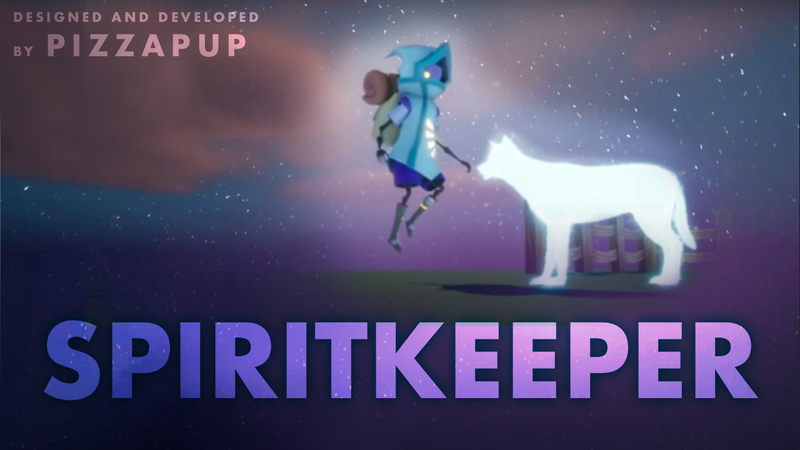

# SpiritKeeper

UE5 Game Designed &amp; Developed by Pizzapup

> Check out the [Trailer on YouTube](https://youtu.be/PZP7UQ7snKM)

## Overview

One of my first Unreal Engine projects. Developed using C++ and visual scripting with UE blueprints. 
  
The following are some of my favorite features that I fully designed and developed for this game:
- Inventory + Dialogue + Mission/Quest system
- Advanced interaction system utilizing enhanced input / mapping
- Blueprints are designed to be reusable and dynamic
- Fully custom textures, materials, niagara systems, lighting, atmosphere, sky, and environment

## Lore + Development/Design Decisions (GDD)

<h3 id='lore'>World History/Underlying Narrative</h2>

   
&nbsp;&nbsp;&nbsp;&nbsp;&nbsp;&nbsp; Behind every town is a Spirit Keeper. Spirit Keepers are responsible for ushering souls of
residents into the town through the Spirit Well. The size, location, and inhabitants of the town
are all decided by the Spirit Keeper. The key resident the Spirit Keeper chooses is the Innkeeper.
Innkeepers are the heart and soul of each community. The Innkeeper greets new arrivals and
helps them settle into their new home.

&nbsp;&nbsp;&nbsp;&nbsp;&nbsp;&nbsp; The Innkeeper helps direct the Spirit Keeper along on their journey to fill the town and
discover themselves in the process. As the founders of each town, Spirit Keepers are
responsible for filling it with residents. Key citizen slots (merchant, gardener, metalsmith,
angler, etc) are listed on the “Town Log” and must be carefully filled. Residents can often
summon their friends and family into the town without needing the formality of the Spirit
Keeper.

&nbsp;&nbsp;&nbsp;&nbsp;&nbsp;&nbsp; To create a cozy, cohesive environment a “Request Ticket” system is used. A Request
Ticket is filled out with a spirit’s name and given to the Spirit Keeper for passage through the
Spirit Well and residency in the town. Request tickets are planted in the “Yard” of the Spirit
Keeper cave. Once planted, the Spirit Keeper can access all the information needed on how to
summon the spirit (the ticket is planted (buried) in a plot and a tombstone grows out displaying
a little info on the spirit – info is updated in the Spirit Keeper’s journal).

&nbsp;&nbsp;&nbsp;&nbsp;&nbsp;&nbsp; Each spirit requires a unique offering at the Spirit Well in the middle of town. The Spirit Keeper must complete whatever quests or tasks necessary to obtain the required offering(s) and offer them at the well. A successful offering will summon the intended spirit through the well – they will rise in a ball of blue light that then dissolves leaving the full spirit in view. New arrivals will often say a word of thanks to the Spirit Keeper before following the Innkeeper into the Inn for arrangements.

&nbsp;&nbsp;&nbsp;&nbsp;&nbsp;&nbsp; Request Tickets come from residents as they find the need for certain things and know the perfect spirit to fill the spot (the baker needs the gardener, the angler needs the metalsmith, etc). The Spirit Keeper is allotted a certain number of executive citizen requests depending on how many residents the town has.

&nbsp;&nbsp;&nbsp;&nbsp;&nbsp;&nbsp; Each new resident adds more life to the town. Another shop open, room filled, building constructed, flower planted, etc. The grounds the town is built upon are beautiful and ready to be explored. Potions and unlocks allow the Spirit Keeper to access more and more areas.

&nbsp;&nbsp;&nbsp;&nbsp;&nbsp;&nbsp; Spirit Keepers live outside of town, typically in caves, caverns, swamps, or mountains each with a beautifully cared for garden bed known as the “Yard”. The Spirit Keepers are trained by elder Spirit Keepers, far scarier in appearance. The elder Spirit Keepers stay at their base, tending to the Yard and receiving any stray messages. They find their way to town by following the spirit river, which leads to the Spirit Well right outside of the Inn. Most are excellent at boating. Large backpacks, organized inventories, and big journals are signature Spirit Keeper belongings. Journals include notes from explorations, town logs, citizen lists, to-do lists (missions), and maps.

<h3 id='ux'>User Experience</h3>

  
 &nbsp;&nbsp;&nbsp;&nbsp;&nbsp;&nbsp; I want players to be interested in both the story as well as the exploring the world. I hope the story makes exploring the world more fun and interesting (What will you find? What can you use? Will there be others?) The player shouldn’t feel the need to rush to complete objectives or “beat” the game. Many objectives can be completed and discovered in any order, though there are some that required prior unlocks (getting to higher areas, unlocking parts of the map, new abilities, needing a certain citizen to do a job e.g. merchant, gardener, etc).
 &nbsp;&nbsp;&nbsp;&nbsp;&nbsp;&nbsp; Every aspect of the game should be enjoyable, not just the plot or completing objectives. It should be something someone can play for many reasons, to settle down or to make achievements.
The inputs are mapped to be minimal. You use the same few buttons for almost everything. This can be both helpful and tricky depending on the task, but never irritating. The sound effects are subtle and gentle. None of the characters speak verbally.

The world is meant to feel dreamy, interesting, and full of secrets – <em>worth exploring.</em>

<h3 id='objective'>Current Situation/Game Objective</h3>

   
&nbsp;&nbsp;&nbsp;&nbsp;&nbsp;&nbsp; You are a young Spirit Keeper ready explore the new terrain and build the town. You must learn to navigate the world, summon spirits, complete quests, and explore.

<h3 id='flow'>Game Flow</h3>

  
   
Most of the interactions in the world are performed by overlapping collision triggers and using the designated inputs.

PC Inputs that are used most in the game:
- Left click: interact (one arm reaches out)
- Keyboard “E”: interact (both arms reach out/push)
- Spacebar: jump (double click spacebar to fly)

 &nbsp;&nbsp;&nbsp;&nbsp;&nbsp;&nbsp; After speaking with the elder, the first step is to find your way to town and talk to your Innkeeper. A note at the Inn tells you where to find the Spirit Well and how to use it. Inside of the note is a room key. This is your first offering. The Innkeeper is the first resident of each town and chosen by the Spirit Keeper before plans even being. They help teach and guide new Spirit Keepers as well as assist new residents moving in. The Innkeeper will show you the Spirit Well and teach you how to summon. The room key inside of the note is the offering that will summon the Innkeeper at the Spirit Well. (Like a mini tutorial)

<h3 id='decisions'>Level Design Decisions</h3>

  
 
&nbsp;&nbsp;&nbsp;&nbsp;&nbsp;&nbsp; The world needed to have two main locations: the town (with the inn and the well) and the Spirit Keeper base (the cave). The Spirit Well is fed by the Spirit River, the “Yard” is also watered by the Spirit River – because of the prominence of the river, I wanted the world to feel built around it. Bridges, wells, boats, caves, waterfalls, mountains, etc. – these are all meant to highlight the water. The dark/nighttime-y atmosphere is meant to make it feel like more of a “spirit realm” and also works well to bring out the glowing reflections in the water. The Spirit Well is meant to be the main point of the town, located outside of the inn (so that the innkeeper can help with new arrivals). The well is fed directly by the river and has a small offering bowl on the front. It emits a soft green, blue glow from inside. If you look into the well you can make out the top of a spiral staircase underneath the water.
 &nbsp;&nbsp;&nbsp;&nbsp;&nbsp;&nbsp; The buildings in the town are mostly decorative/cannot enter. But the buildings that are important to the story can be entered. The Inn is the most prominent building. Collision is disabled for most doors and objects since spirits can pass right through.
 &nbsp;&nbsp;&nbsp;&nbsp;&nbsp;&nbsp; The boat operates via a lever on a post near the docks. When activated, the lantern on the boat will glow a dim yellow to indicate it is about to move, then a brighter orange as it navigates to the next destination, then back to normal once stopped. The boat operates on a spline path and the character can jump off at any time if wanted. 
&nbsp;&nbsp;&nbsp;&nbsp;&nbsp;&nbsp; The boat helps shorten the journey (and make it more fun) between the base and the town. Since each ticket needs to be planted at the Yard, and each offering needs to be given to the Spirit Well, the locations are both frequented.

